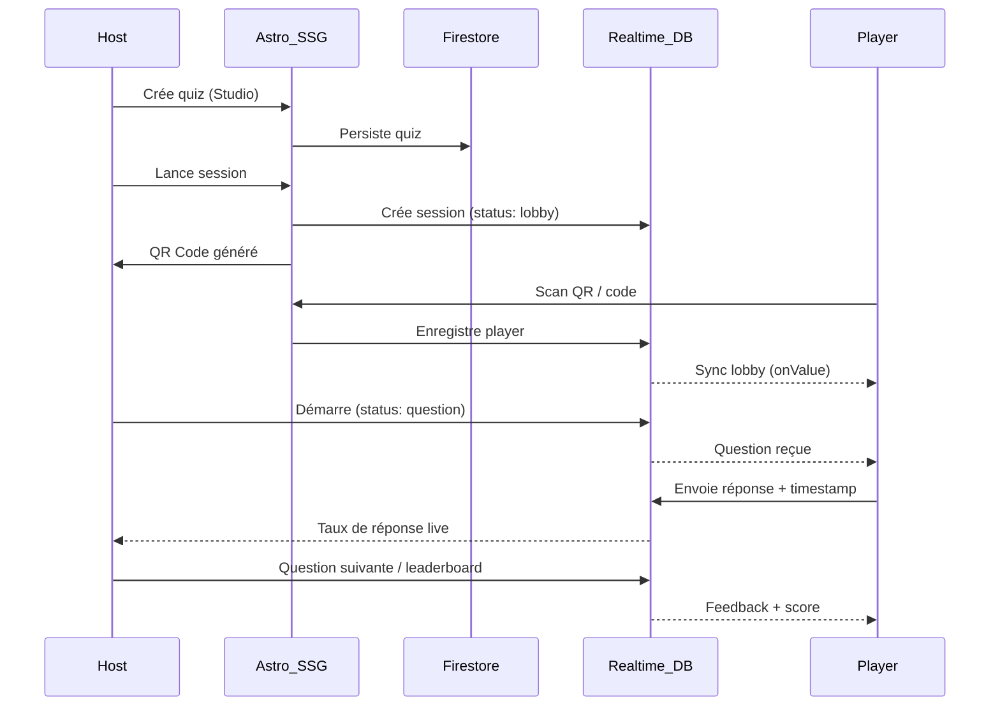

# QuizTown -- "Play. Vote. Learn."

## Vue d'ensemble

QuizTown est une plateforme de quiz interactifs en temps réel, construite avec **Astro 5** (pages statiques ultra-rapides) + **React Islands** (interactivité temps réel) + **Firebase** (auth, data, live). Le tout dans un design system vibrant avec animations fluides.

## Stack technique

- **Astro 5.x** -- squelette statique, routing, i18n, SSG
- **React 19** -- islands pour composants interactifs (buzzer, leaderboard, control deck)
- **TypeScript strict** -- zéro `any`, types partout
- **Tailwind CSS v4** + CSS custom properties pour les design tokens QuizTown
- **Framer Motion** -- animations React (vote tiles, leaderboard, countdown)
- **Firebase Auth** -- SSO Google pour les hosts (@techtown.fr)
- **Cloud Firestore** -- stockage quiz, résultats, historique
- **Firebase Realtime Database** -- moteur live (sessions, votes, scores)
- **Firebase Hosting** -- déploiement
- **qrcode** (lib) -- génération QR codes pour rejoindre les sessions
- **Vitest** + **React Testing Library** -- tests unitaires
- **@testing-library/jest-dom** -- matchers DOM
- **Playwright** -- tests E2E (création quiz, dashboard, lancement session)

## Architecture des fichiers

```
quiztown/
├── AGENTS.md                          # Instructions IA (conventions, stack, règles)
├── README.md                          # Documentation projet + deploy
├── .gitignore                         # Node, Firebase, Astro, .env
├── astro.config.mjs
├── tailwind.config.mjs
├── tsconfig.json
├── package.json
├── firebase.json
├── .firebaserc
├── vitest.config.ts                   # Config tests unitaires
├── playwright.config.ts               # Config tests E2E
├── public/
│   ├── fonts/
│   │   ├── SpaceGrotesk-*.woff2      # Titres / branding
│   │   └── Inter-*.woff2             # UI / body
│   └── images/
│       └── quiztown-logo.svg
├── src/
│   ├── components/                    # Composants Astro (statique)
│   │   ├── SEOHead.astro
│   │   ├── Header.astro
│   │   ├── Footer.astro
│   │   └── QuizCard.astro
│   ├── islands/                       # React Islands (interactif)
│   │   ├── JoinForm.tsx              # Ecran 01: Join Town
│   │   ├── WaitingRoom.tsx           # Ecran 02: Lobby
│   │   ├── PlayerBuzzer.tsx          # Ecran 03: Spot (question)
│   │   ├── VoteLock.tsx              # Ecran 04: Lock & Wait
│   │   ├── FeedbackScreen.tsx        # Ecran 05: Feedback perso
│   │   ├── Leaderboard.tsx           # Ecran 06: Classement
│   │   ├── PublicScreen.tsx          # Ecran projection (16:9)
│   │   ├── AuthGuard.tsx              # Garde auth Google SSO (désactivable)
│   │   ├── HostDashboard.tsx         # Ecran H1: Dashboard (listing + lancement)
│   │   ├── HostCreatePage.tsx        # Wrapper création quiz + auth + redirect
│   │   ├── HostEditPage.tsx          # Wrapper édition quiz (charge Firestore + pré-remplit QuizEditor + updateQuiz)
│   │   ├── HostLivePage.tsx          # Wrapper live session (query string + RTDB + quiz fetch + callbacks)
│   │   ├── HostLiveControl.tsx       # Ecran H2: Live Control (ControlDeck + QR code lobby)
│   │   ├── PlayerSession.tsx         # Orchestrateur session joueur Firebase (join->waiting->question->feedback->finished)
│   │   ├── CrowdStats.tsx            # Ecran H3: Stats
│   │   ├── QuizEditor.tsx            # Studio: création quiz
│   │   └── ui/                       # Design system React
│   │       ├── VoteTile.tsx
│   │       ├── CountdownRing.tsx
│   │       ├── XPBadge.tsx
│   │       ├── LeaderboardRow.tsx
│   │       ├── Timer.tsx
│   │       └── GifPicker.tsx          # Modal recherche GIF (GIPHY)
│   ├── lib/                            # Helpers externes
│   │   └── giphy.ts                   # Wrapper API GIPHY (search, trending)
│   ├── firebase/                      # Firebase SDK + helpers
│   │   ├── config.ts
│   │   ├── auth.ts
│   │   ├── firestore.ts
│   │   └── realtime.ts               # createSession, joinSession, submitResponse, setCurrentQuestion, revealAnswer, clearCorrectOption, onSessionChange, endSession
│   ├── hooks/                         # React hooks custom
│   │   ├── useSession.ts             # Ecoute session RTDB
│   │   ├── useCountdown.ts           # Timer question
│   │   ├── useLeaderboard.ts         # Classement live
│   │   └── useAuth.ts               # Auth Firebase
│   ├── i18n/
│   │   └── index.ts                  # Traductions FR/EN
│   ├── layouts/
│   │   ├── Layout.astro              # Layout principal
│   │   ├── GameLayout.astro          # Layout joueur (plein écran)
│   │   └── HostLayout.astro          # Layout host (dashboard)
│   ├── pages/
│   │   ├── index.astro               # Landing page
│   │   ├── play/
│   │   │   └── [id].astro            # Joueur: rejoint session
│   │   ├── host/
│   │   │   ├── index.astro           # Dashboard host
│   │   │   ├── create.astro          # Création quiz
│   │   │   ├── edit.astro            # Édition quiz (charge via ?id=xxx)
│   │   │   └── live/
│   │   │       ├── index.astro       # Control deck (session via query string)
│   │   │       └── [id].astro        # Control deck (demo)
│   │   ├── screen/
│   │   │   └── [id].astro            # Ecran public/projection
│   │   └── en/                       # Pages anglaises (i18n)
│   │       ├── index.astro
│   │       └── ...
│   ├── styles/
│   │   └── global.css                # Design tokens + base
│   └── types/
│       ├── quiz.ts                   # Types Quiz, Question, Option
│       ├── session.ts                # Types Session, Player, Response
│       └── index.ts                  # Re-exports
├── tests/                             # Tests unitaires (Vitest)
│   ├── setup.ts                      # Setup global (jsdom, mocks Firebase)
│   ├── hooks/
│   │   ├── useCountdown.test.ts
│   │   ├── useSession.test.ts
│   │   └── useLeaderboard.test.ts
│   ├── islands/
│   │   ├── VoteTile.test.tsx
│   │   ├── CountdownRing.test.tsx
│   │   ├── JoinForm.test.tsx
│   │   └── Leaderboard.test.tsx
│   └── utils/
│       ├── scoring.test.ts
│       └── session-state.test.ts
├── e2e/                               # Tests E2E (Playwright)
│   ├── quiz-flow.spec.ts             # Création quiz, dashboard, lancement
│   ├── quiz-edit.spec.ts             # Édition quiz: modifier titre/question/option, sauvegarder, vérifier
│   └── live-session.spec.ts          # Session live: QR code, joueur rejoint, Démarrer, réponse, résultats
└── spec/                              # Specs existantes
```

## Design System -- Tokens CSS

Le fichier `src/styles/global.css` définira les tokens du design system QuizTown :

```css
:root {
  /* Couleurs principales */
  --color-electric-blue: #2563EB;
  --color-violet-pulse: #7C3AED;
  --color-mint-pop: #2DD4BF;

  /* Couleurs secondaires */
  --color-dark-slate: #0F172A;
  --color-soft-white: #F8FAFC;
  --color-alert-coral: #FB7185;

  /* Couleurs VoteTiles (accessibles daltonisme) */
  --color-tile-cross: #2563EB;     /* ✕ Bleu - luminance moyenne-basse */
  --color-tile-circle: #F59E0B;    /* ○ Orange - luminance haute */
  --color-tile-triangle: #10B981;  /* △ Vert émeraude - luminance moyenne */
  --color-tile-square: #EC4899;    /* □ Rose - luminance moyenne-haute */

  /* Typographie */
  --font-display: 'Space Grotesk', sans-serif;
  --font-body: 'Inter', sans-serif;

  /* Spacing (8px grid) */
  --spacing-xs: 0.25rem;
  --spacing-sm: 0.5rem;
  --spacing-md: 1rem;
  --spacing-lg: 1.5rem;
  --spacing-xl: 2rem;
  --spacing-2xl: 3rem;

  /* Radius */
  --radius-card: 16px;
  --radius-button: 12px;
  --radius-full: 9999px;

  /* Animations */
  --duration-fast: 150ms;
  --duration-normal: 300ms;
  --duration-slow: 500ms;
}
```

Tailwind sera configuré pour utiliser ces CSS variables comme thème, ce qui garantit la cohérence entre composants Astro (CSS pur) et React islands (Tailwind classes).

## Modèle de données

### Firestore -- `quizzes` collection

Conforme au schéma [TECH.md](TECH.md) : `metadata`, `settings`, `questions[]` avec `options[]`, `timeLimit`, `codeSnippet`, `media`.

Helpers (`src/firebase/firestore.ts`) : `createQuiz`, `getQuiz`, `getQuizzesByAuthor`, `getAllQuizzes`, `updateQuiz`, `deleteQuiz`.

### Realtime Database -- Sessions live

```
sessions/{sessionId}/
  ├── status: "lobby" | "question" | "feedback" | "leaderboard" | "finished"
  ├── currentQuestion: { id, label, media?, options[], timeLimit, startedAt }
  ├── currentQuestionIndex: number
  ├── totalQuestions: number
  ├── correctOptionId?: string          # Set by host when revealing results
  ├── quizId: string                    # Reference to Firestore quiz document
  ├── hostId: string                    # Firebase Auth UID of the host
  ├── players/
  │   └── {playerId}: { nickname, badge, score, streak, connected }
  └── responses/
      └── {questionId}/
          └── {playerId}: { optionId, timestamp }
```

**Règles de sécurité** :
- Ne jamais envoyer `isCorrect` aux joueurs -- `sanitizeQuestion()` dans `HostLivePage.tsx` supprime ce champ avant l'envoi RTDB
- `correctOptionId` n'est écrit que lorsque le host clique "Afficher les résultats" (jamais envoyé avec la question)
- Ne jamais écrire `undefined` dans la RTDB Firebase (utiliser `null` ou omettre le champ)

## Flow technique



---

## Phases d'implémentation (MVP)

### Phase 0 : Bootstrap projet

- [x] `AGENTS.md` -- conventions IA : stack, patterns Astro/React, règles DRY, i18n, CSS variables, nommage, structure fichiers
- [x] `README.md` -- description projet, stack, prérequis, commandes dev/build/test/deploy
- [x] `.gitignore` -- Node (`node_modules`, `dist`), Firebase (`.firebase`, `.firebaserc`), Astro (`.astro`), env (`.env*`), IDE, OS
- [x] `git init` + premier commit

### Phase 1 : Fondations

- [x] Initialiser projet Astro 5 + React + Tailwind v4
- [x] Configurer Firebase (auth, firestore, realtime)
- [x] Configurer Vitest + React Testing Library + jsdom
- [x] Créer le design system (tokens CSS, composants de base)
- [x] Layout principal + i18n (FR/EN)
- [x] Landing page QuizTown (hero CTA: "Créer un quiz" uniquement -- pas de join depuis la landing, les joueurs rejoignent via le lien/QR partagé par le host)
- [x] **Responsive** : mobile-first, breakpoints tablette (768px), desktop (1024px), écran géant (16:9)

### Phase 2 : Studio Quiz (Host)

- [x] Page création de quiz (`QuizEditor.tsx`)
- [x] Formulaire questions QCM + timer + media
- [x] Sauvegarde Firestore
- [x] Bibliothèque de quiz (dashboard host) -- `HostDashboard.tsx` avec listing, lancement et suppression
- [x] Auth Firebase (Google SSO) -- `AuthGuard.tsx` (désactivé temporairement pour dev)
- [x] `HostCreatePage.tsx` -- wrapper auth + sauvegarde Firestore + redirect dashboard
- [x] `HostEditPage.tsx` -- édition quiz existant (charge depuis Firestore, pré-remplit QuizEditor, updateQuiz)
- [x] Route `/host/edit?id=xxx` pour éditer un quiz existant
- [x] Bouton "Modifier" dans le dashboard (lien vers `/host/edit?id=xxx`)
- [x] `QuizEditor.tsx` supporte le mode édition (props `initialTitle`, `initialDescription`, `initialQuestions`)
- [x] Bouton "Mettre à jour" / "Update" en mode édition (au lieu de "Sauvegarder" / "Save")
- [x] `HostLivePage.tsx` -- lecture session ID via query string, souscription Realtime DB
- [x] Route statique `/host/live/` pour sessions dynamiques (session ID via `?session=xxx`)

### Phase 3 : Moteur Live

- [x] Création session Realtime DB
- [x] Génération QR Code (lib `qrcode`, affiché dans le lobby HostLiveControl)
- [x] Hooks React : `useSession`, `useCountdown`, `useLeaderboard`
- [x] Logique de scoring (vitesse + exactitude)
- [x] State machine session (lobby -> question -> feedback -> leaderboard -> finished)
- [x] Callbacks HostLivePage : Démarrer (push question sanitisée), Suivant, Afficher résultats (`revealAnswer`), Terminer
- [x] `PlayerSession.tsx` : orchestrateur Firebase joueur (join -> waiting -> question -> feedback -> leaderboard -> finished, bouton "Rejouer" supprimé)
- [x] Rewrites Firebase Hosting (`/play/**`, `/host/live/**`, `/screen/**`) pour sessions dynamiques

### Phase 4 : Expérience Joueur

- [x] `JoinForm.tsx` -- rejoindre en 5 secondes (QR/code + pseudo + badge)
- [x] `WaitingRoom.tsx` -- animation ville + compteur citizens
- [x] `PlayerBuzzer.tsx` -- VoteTiles avec animations Framer Motion
- [x] `VoteLock.tsx` -- confirmation vote (intégré dans PlayerBuzzer)
- [x] `FeedbackScreen.tsx` -- correct/incorrect + XP + streak
- [x] `Leaderboard.tsx` -- top 5 animé + position perso

### Phase 5 : Host ControlDeck

- [x] `HostDashboard.tsx` -- tableau de bord session
- [x] `HostLiveControl.tsx` -- lancer/pause/skip/lock + QR code lobby + join URL avec copie
- [x] `CrowdStats.tsx` -- intégré dans HostLiveControl (stats bar)
- [x] Bouton "Démarrer" fonctionnel (fetch quiz Firestore, sanitize question, push RTDB)
- [x] Bouton "Afficher les résultats" (écrit `correctOptionId` dans session RTDB)
- [x] Bouton "Suivant" (clear correctOptionId, push question suivante)
- [x] Bouton "Terminer" (status: finished)
- [x] **Timer countdown** sur le ControlDeck (affiche les secondes restantes pendant la phase question, vert → orange → rouge)
- [x] **Flow linéaire obligatoire** : question → feedback → leaderboard → suivant/terminer (un seul bouton d'action par phase)
- [x] Bouton "Afficher les résultats" pulse quand timer=0 ou tous ont répondu
- [x] Classement affiché après chaque question (pas seulement la dernière)
- [x] Bouton "Terminer le quiz" uniquement à la dernière question (après leaderboard)
- [x] Suppression du bouton "Terminer" toujours présent
- [x] **Question preview dans ControlDeck** : affiche le texte de la question, le GIF/image (si présent), et les réponses possibles avec pictogrammes (✕ ○ △ □) + couleurs tile pendant les phases question et feedback

### Phase 6 : Ecran Public

- [x] `PublicScreen.tsx` -- optimisé 16:9, lisible à 20m
- [x] Question géante + countdown ring
- [x] Barres de votes animées en temps réel
- [x] Résultat + bonne réponse highlighted

### Phase 7 : Tests

- [x] **Vitest** + **React Testing Library** + **jsdom** configurés
- [x] Tests hooks : `useCountdown` (timer, pause, expiration), `useLeaderboard` (tri, top 5)
- [ ] Tests composants UI : ~~`VoteTile`~~, `CountdownRing`, `JoinForm`, `Leaderboard` (`VoteTile` ✓ -- 26 tests pictogrammes, accessibilité, palette, états, interactions)
- [x] Tests logique métier : scoring (vitesse + exactitude), state machine session (transitions valides/invalides)
- [ ] Mocks Firebase (Realtime DB, Firestore, Auth)
- [x] Scripts npm : `npm test`, `npm run test:watch`, `npm run test:coverage`
- [x] **Playwright** E2E configuré (Chromium, Astro dev server)
- [x] E2E : création quiz (formulaire, sauvegarde, toast succès, redirect dashboard)
- [x] E2E : quiz visible dans le dashboard (titre, bouton Lancer)
- [x] E2E : édition quiz (`quiz-edit.spec.ts`) :
  - [x] Bouton "Modifier" visible dans le dashboard
  - [x] Navigation vers `/host/edit?id=xxx`
  - [x] Données pré-remplies (titre, description, question, options)
  - [x] Bouton "Mettre à jour" visible (pas "Sauvegarder")
  - [x] Modification titre + question + option, sauvegarde, toast succès
  - [x] Quiz modifié visible dans le dashboard avec le nouveau titre
  - [x] Suppression du quiz modifié
- [x] Tests unitaires QuizEditor mode édition (`QuizEditorEdit.test.tsx`) :
  - [x] Données pré-remplies (titre, description, questions, options, bonne réponse)
  - [x] Label bouton "Mettre à jour" / "Update" en mode édition
  - [x] Édition et sauvegarde avec données modifiées
  - [x] Ajout/suppression de questions en mode édition
  - [x] Validation en mode édition
- [x] E2E : lancement quiz (session Realtime DB, navigation `/host/live/?session=xxx`, ControlDeck en statut Lobby)
- [x] E2E : session live complète (`live-session.spec.ts`) :
  - [x] Host : QR code + join URL affichés en lobby
  - [x] Player : rejoint via join link, nickname, waiting room
  - [x] Host : Démarrer -> question en cours visible host + player
  - [x] Player : soumet réponse, vote verrouillé
  - [x] Host : Afficher résultats -> feedback joueur
  - [x] Host : Question suivante -> player voit question 2
  - [x] Host : Terminer -> session terminée côté host + player
- [x] Scripts npm : `npm run test:e2e`, `npm run test:e2e:ui`

### Phase 8 : Polish & Production

- [x] Mode sombre (via prefers-color-scheme dans global.css)
- [x] Animations micro-interactions (Framer Motion dans tous les islands)
- [x] PWA manifest
- [ ] Performance audit (< 300ms animations)
- [ ] Tests accessibilité (contraste AA)
- [x] **Accessibilité daltonisme -- VoteTiles** :
  - [x] Remplacer la palette VoteTile (Coral/Mint problématiques) par palette accessible : Bleu `#2563EB`, Orange `#F59E0B`, Vert émeraude `#10B981`, Rose `#EC4899`
  - [x] Ajouter les tokens CSS : `--color-tile-cross`, `--color-tile-circle`, `--color-tile-triangle`, `--color-tile-square` dans `global.css`
  - [x] Ajouter les pictogrammes PlayStation (✕ ○ △ □) dans le badge de chaque VoteTile (32×32px, 48×48px en projection)
  - [x] Mettre à jour `VoteTile.tsx` : remplacer `TILE_COLORS` par nouvelle palette + pictogrammes SVG/Unicode
  - [x] Mettre à jour `QuizEditor.tsx` : afficher pictogrammes au lieu des cercles colorés (12×12px actuel)
  - [x] Mettre à jour `PlayerBuzzer.tsx` : passer les pictogrammes aux VoteTiles
  - [x] Mettre à jour `PublicScreen.tsx` : barres de vote avec pictogramme + couleur accessible
  - [x] Ajouter `aria-label` sur chaque VoteTile incluant le pictogramme (ex: "Réponse A - Croix")
  - [ ] Valider le contraste des nouvelles couleurs sur fond clair ET fond sombre
- [x] Firebase Security Rules (Firestore + RTDB)

### Phase 9 : Documentation deploy + CI/CD

- [x] Mettre à jour `README.md` avec instructions complètes :
  - Prérequis (Node 20+, Firebase CLI, compte Firebase)
  - Variables d'environnement (`.env.example`) -- simplified with optional JSON config
  - `npm run dev` / `npm run build` / `npm run preview`
  - `npm test` / `npm run test:coverage`
  - `npm run test:e2e` / `npm run test:e2e:ui`
  - `firebase deploy` (Hosting)
  - Configuration projet Firebase (Firestore rules, RTDB rules, Auth providers)
- [x] GitHub Actions CI/CD : lint, test, build, deploy on push to main

### Phase 10 : Media (GIF)

- [ ] Étendre `QuizMedia` : ajouter type `'gif'`, champ `alt` optionnel
- [ ] Ajouter `media` optionnel à `CurrentQuestion` (session.ts)
- [ ] Installer `@giphy/js-fetch-api`
- [ ] Créer `src/lib/giphy.ts` -- wrapper API GIPHY (search, trending, rating:g)
- [ ] Créer `GifPicker.tsx` -- modal recherche GIF (grille, trending, attribution GIPHY)
- [ ] Mettre à jour `QuizEditor.tsx` -- bouton GIF, prévisualisation, suppression
- [ ] Mettre à jour `PlayerBuzzer.tsx` -- afficher media (GIF/image) au-dessus des VoteTiles
- [ ] Mettre à jour `PublicScreen.tsx` -- afficher media en grand (projection 16:9)
- [x] Propager media dans session RTDB (`setCurrentQuestion`)
- [x] Afficher media (GIF/image) + question + réponses dans le ControlDeck host
- [ ] Labels i18n FR/EN pour tous les nouveaux textes
- [ ] `PUBLIC_GIPHY_API_KEY` dans `.env.example`

---

## Points différenciants "qui déchire"

- **Countdown Ring SVG animé** qui passe du vert au rouge avec micro-vibration à 3 secondes
- **VoteTiles avec spring animations** (Framer Motion) -- scale au tap, shake quand incorrect, confetti quand correct
- **Pictogrammes PlayStation (✕ ○ △ □)** -- identification visuelle par forme + couleur + position, accessible aux daltoniens
- **Palette VoteTiles optimisée daltonisme** -- Bleu/Orange/Vert émeraude/Rose avec variation de luminance forte, fini les confusions Coral/Mint
- **Leaderboard "bounce"** -- les positions remontent/descendent avec des animations physiques
- **Haptic feedback** sur mobile (navigator.vibrate) au tap sur les réponses
- **Gradient pulse** sur la waiting room (ambiance "ville qui s'active")
- **QR Code** instantané pour rejoindre -- zéro friction, zéro compte
- **Mode projection 16:9** -- texte géant, branding discret, lisible à 20m
- **GIF intégré façon Kahoot** -- recherche GIPHY avec rating:g, picker fluide, rendu plein écran sur projecteur
