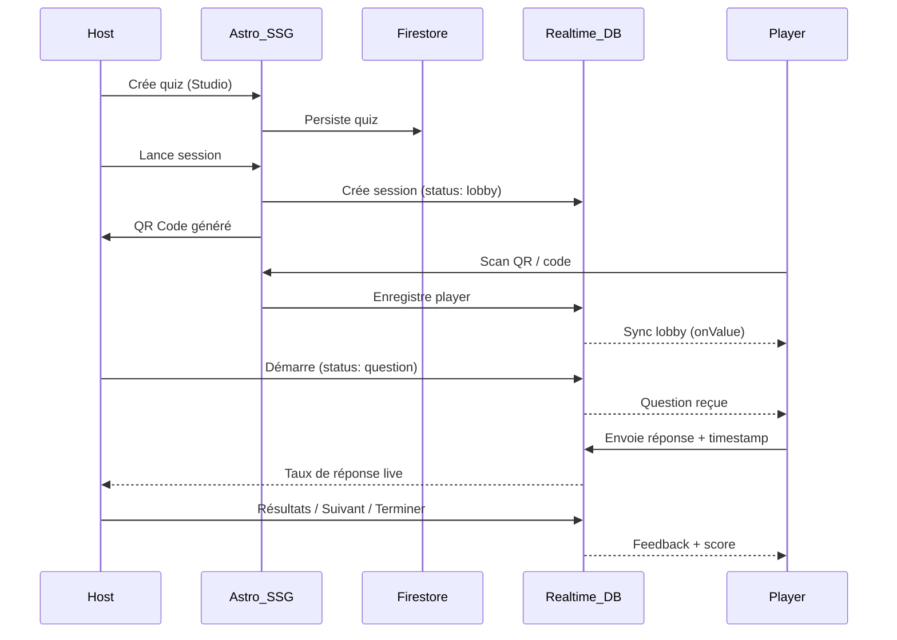

# QuizTown -- Spécification Technique

## Architecture Globale : "The Realtime Static Stack"

L'objectif est de garder une interface ultra-rapide (Astro) tout en déléguant la complexité du temps réel et de la donnée à Firebase.

| Composant       | Technologie              | Rôle                                                                 |
|-----------------|--------------------------|----------------------------------------------------------------------|
| Frontend        | Astro 5 + React Islands  | Squelette statique (Landing, Dashboard). Islands pour les composants interactifs. |
| Authentification| Firebase Auth            | SSO Google pour les hosts.                                           |
| Gestion Quiz    | Cloud Firestore          | Base documentaire pour stocker questions, médias et historiques.      |
| Moteur Live     | Firebase Realtime DB     | Synchronisation instantanée (question en cours, joueurs, scores).    |
| Hébergement     | Firebase Hosting         | Intégration fluide avec les services Firebase.                       |

## Structuration de la donnée

### Cloud Firestore (Le "Cerveau" Statique)

Stocke tout ce qui n'a pas besoin d'une mise à jour à la milliseconde près.

**Collection `quizzes`** -- chaque document représente un quiz complet :

```json
{
  "id": "quiz_abc_123",
  "metadata": {
    "title": "Culture Tech & Craftsmanship",
    "description": "Le quiz hebdomadaire pour tester nos connaissances JS/TS",
    "authorId": "user_789",
    "createdAt": "2026-02-07T18:00:00Z",
    "tags": ["frontend", "internal", "fun"]
  },
  "settings": {
    "isPublic": false,
    "shuffleQuestions": true,
    "pointsPerQuestion": 1000,
    "theme": "dark-mode"
  },
  "questions": [
    {
      "id": "q1",
      "type": "multiple-choice",
      "label": "Quelle est la sortie de console.log(typeof NaN) ?",
      "media": {
        "type": "image",
        "url": "https://..."
      },
      "codeSnippet": "console.log(typeof NaN);",
      "options": [
        { "id": "opt1", "text": "number", "isCorrect": true },
        { "id": "opt2", "text": "NaN", "isCorrect": false },
        { "id": "opt3", "text": "undefined", "isCorrect": false },
        { "id": "opt4", "text": "object", "isCorrect": false }
      ],
      "timeLimit": 20
    }
  ]
}
```

> Les types TypeScript correspondants sont dans `src/types/quiz.ts` (`Quiz`, `QuizQuestion`, `QuizOption`, `QuizMedia`, `QuizMetadata`, `QuizSettings`).

**Collection `results`** : Archivage des sessions terminées pour analyse (scores finaux, statistiques par question).

Helpers Firestore (`src/firebase/firestore.ts`) : `createQuiz`, `getQuiz`, `getQuizzesByAuthor`, `getAllQuizzes`, `updateQuiz`, `deleteQuiz`.

### Firebase Realtime Database (Le "Cœur" Live)

Latence extrêmement faible, idéale pour le buzzer et la synchronisation temps réel.

```
sessions/{sessionId}/
  ├── status: "lobby" | "question" | "feedback" | "leaderboard" | "finished"
  ├── currentQuestion: { id, label, media?, options[], timeLimit, startedAt }
  ├── currentQuestionIndex: number
  ├── totalQuestions: number
  ├── correctOptionId?: string          # Set by host when revealing results
  ├── quizId: string                    # Reference to Firestore quiz document
  ├── hostId: string                    # Firebase Auth UID of the host
  ├── players/
  │   └── {playerId}: { nickname, badge, score, streak, connected }
  └── responses/
      └── {questionId}/
          └── {playerId}: { optionId, timestamp }
```

> Les types TypeScript correspondants sont dans `src/types/session.ts` (`Session`, `SessionStatus`, `Player`, `PlayerResponse`, `CurrentQuestion`).

### Passerelle Firestore → Realtime DB

Lorsqu'un Host lance un quiz :
1. Il récupère le document quiz depuis Firestore
2. Il crée une session dans la Realtime Database (status: `lobby`)
3. Il n'injecte que la question courante (pas toutes les réponses correctes)

**Règle de sécurité** : ne jamais envoyer `isCorrect` aux joueurs. `sanitizeQuestion()` dans `HostLivePage.tsx` supprime ce champ avant l'envoi en RTDB. `correctOptionId` n'est écrit que lorsque le host clique "Afficher les résultats".

## Workflow Technique



## Pourquoi ce choix technique ?

- **Performance (Astro)** : Temps de chargement quasi instantané, même sur connexion mobile instable.
- **Scalabilité (Firebase)** : Gestion native de milliers de connexions simultanées.
- **Coût** : Pour un usage interne et quelques conférences, le Spark Plan (gratuit) de Firebase suffit.
